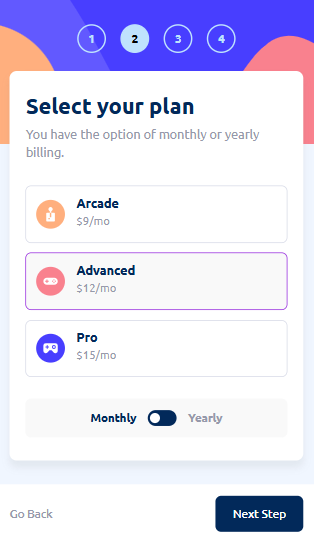
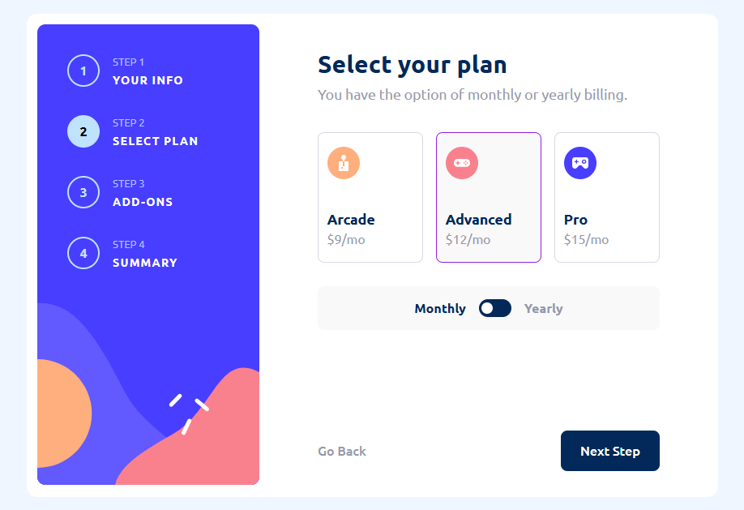

# Frontend Mentor - Multi-step from solution
This project is a solution to the [Multi-step form challenge from Frontend Mentor](https://www.frontendmentor.io/challenges/multistep-form-YVAnSdqQBJ). These challenges offer a hands-on way to build realistic projects and enhance your coding skills.

 

## Overview

### The challenge

Users should be able to:

- Complete each step of the sequence
- Go back to a previous step to update their selections
- See a summary of their selections on the final step and confirm their order
- View the optimal layout for the interface depending on their device's screen size
- See hover and focus states for all interactive elements on the page
- Receive form validation messages if:
  - A field has been missed
  - The email address is not formatted correctly
  - A step is submitted, but no selection has been made

### Screenshots 

|Mobile layout  | Desktop layout |
| ------------- | ------------- |
|   |    |

see the project [Live](https://multi-step-form-project-challenge.netlify.app)

## My process

### Built with

- React
- mobile-first workflow

 

## Future Improvements

- [ ] Migrate to TypeScript for type safety.
- [ ] Style with SCSS.
- [ ] Integrate Redux Toolkit for state management.

 

 

